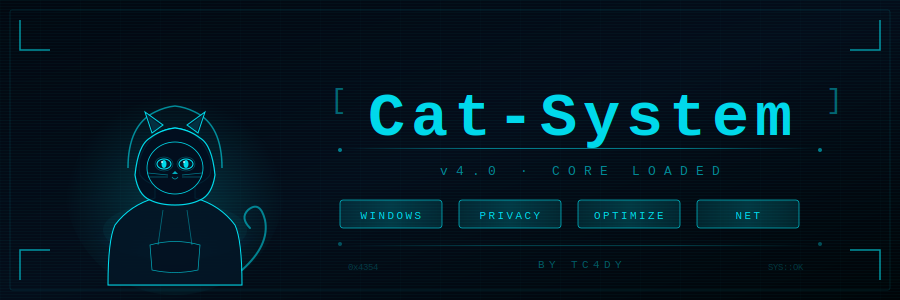

# 🐾 Cat-System v4.0

> **By:** Tc4dy &nbsp;|&nbsp; **Platform:** Windows 10/11 &nbsp;|&nbsp; **Language:** C# (.NET 8) &nbsp;|&nbsp; **Requires:** Administrator

---

Cat-System is a modular Windows optimization tool. Each module runs independently, all changes are logged, and everything can be reverted with a single command.

---

## ⚡ Modules

| Module | What it does |
|---|---|
| 🛡️ **Ghost Protocol** | Disables telemetry, ad tracking, Bing search in Start, location, Activity History and consumer features |
| ⚡ **Sculptor Engine** | Throttles background processes, activates High Performance power plan, tunes memory settings |
| 🚀 **Net Booster** | Flushes DNS cache, resets Winsock/TCP stack, configures TCP parameters and DNS cache TTL |
| 🧹 **Browser Cleaner** | Wipes cache, cookies and history for Chrome, Edge, Firefox, Opera and Brave |
| ⚙️ **Startup Manager** | Lists, adds and removes startup entries from both Registry and Startup folder |
| 🧹 **System Cleaner** | Clears temp folders, Windows logs and Prefetch cache — also runs DISM and Storage Sense |
| ⏪ **Rollback** | Reverts every registry and file change made during the session |

---

## 🔨 Build

**Requirements:**
- [.NET 8 SDK](https://dotnet.microsoft.com/download)
- Windows 10 or 11

```bash
git clone https://github.com/tc4dy/Cat-System.git
cd c
Cat-System

# Build
dotnet build -c Release

# Or produce a single-file exe
dotnet publish -c Release -r win-x64 --self-contained true -p:PublishSingleFile=true
```

Output: `bin/Release/net8.0/win-x64/publish/CatSystem.exe`

> ⚠️ Always run as **Administrator** — registry and system service access requires elevated privileges.

---

## 🚀 Usage

1. Right-click `CatSystem.exe` → **Run as Administrator**
2. Pick a module number from the menu
3. Each module measures a benchmark before and after, and writes everything to `CatSystem_Log.txt`
4. Run `[7] Rollback` at any time to undo all changes

---

## 🔒 Rollback & Safety

Every registry value and file is backed up to `CatSystem_Rollback/` before anything is touched. The Rollback module restores all of them in one shot. Nothing is permanent unless you clear the backup manually.

---

## 📋 Notes

- **Net Booster** and **Sculptor Engine** require a restart for some changes to apply
- Close browsers before running **Browser Cleaner**
- DISM cleanup can take a few minutes depending on the WinSxS store size
- All registry tweaks go through the Group Policy layer (`Software\Policies`) — system-wide and persistent

---

<div align="center">
  <sub>Rollback system and debugging assisted by <strong>Qwen</strong> — built by <strong>Tc4dy</strong></sub>
</div>
