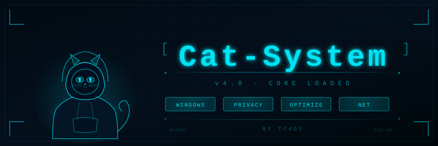
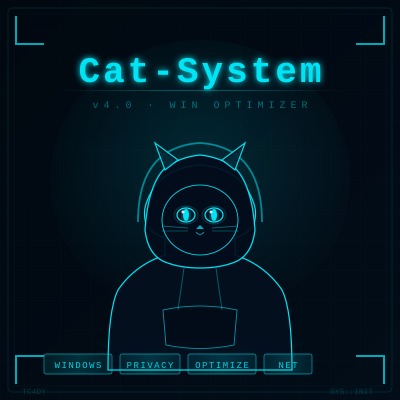

# 🐾 Cat-System v4.1

> **By:** Tc4dy &nbsp;|&nbsp; **Platform:** Windows 10/11 &nbsp;|&nbsp; **Language:** PowerShell 5.1 / 7.x &nbsp;|&nbsp; **Requires:** Administrator

---

Cat-System is a modular Windows optimization tool. Each module runs independently, all changes are logged, and everything can be reverted with a single command. | Single File & Moduler Mode

---

## Modules

| Module | What it does |
|---|---|
| 🛡️ **Ghost Protocol** | Disables telemetry, ad tracking, Bing search in Start, location, Activity History and consumer features — also blocks telemetry hosts, disables scheduled tasks and stops diagnostic services |
| ⚡ **Sculptor Engine** | Throttles background processes, activates High Performance power plan, tunes memory settings |
| 🚀 **Net Booster** | Flushes DNS cache, resets Winsock/TCP stack, configures TCP parameters and DNS cache TTL |
| 🧹 **Browser Cleaner** | Wipes cache, cookies and history for Chrome, Edge, Firefox, Opera and Brave |
| ⚙️ **Startup Manager** | Lists, adds and removes startup entries from both Registry and Startup folder |
| 🧹 **System Cleaner** | Clears temp folders, Windows logs and Prefetch cache — also runs DISM and Storage Sense |
| ⏪ **Rollback** | Reverts every registry, file, scheduled task and hosts change made during the session |

---



## 🔨 Build

**Requirements:**
- Windows 10 or 11
- PowerShell 5.1 (built-in) or PowerShell 7.x
- Administrator privileges

```powershell
git clone https://github.com/tc4dy/Cat-System.git
cd Cat-System

# Run directly
.\Start-CatSystem.ps1

# Or set execution policy for the current session
Set-ExecutionPolicy -Scope Process Bypass -Force
.\Start-CatSystem.ps1
```

For the single-file portable version, run `CatSystem.ps1` from any directory — no installation required.

>  Always run as **Administrator** — registry and system service access requires elevated privileges.

---

## 🚀 Usage

1. Right-click `Start-CatSystem.ps1` → **Run with PowerShell** (or launch from an elevated terminal)
2. Pick a module number from the menu
3. Each module measures a benchmark before and after, and writes everything to `CatSystem_Log.txt`
4. Run `[7] Rollback` at any time to undo all changes

---

## 🔒 Rollback & Safety

Every registry value, file, scheduled task and hosts entry is backed up to `CatSystem_Rollback/` before anything is touched. The Rollback module restores all of them in one shot. Hosts modifications are tracked with begin/end markers, so only Cat-System's own block is removed on rollback — not the entire file.

---

## 📋 Notes

- **Net Booster** and **Sculptor Engine** require a restart for some changes to apply
- Close browsers before running **Browser Cleaner**
- DISM cleanup can take a few minutes depending on the WinSxS store size
- All registry tweaks go through the Group Policy layer (`Software\Policies`) — system-wide and persistent
- Rollback only covers changes made during the current session; clearing the backup folder makes them permanent

---

<div align="center">
  <sub>Built by <strong>Tc4dy</strong> — modular architecture, surgical rollback, zero dependencies beyond PowerShell</sub>
</div>
